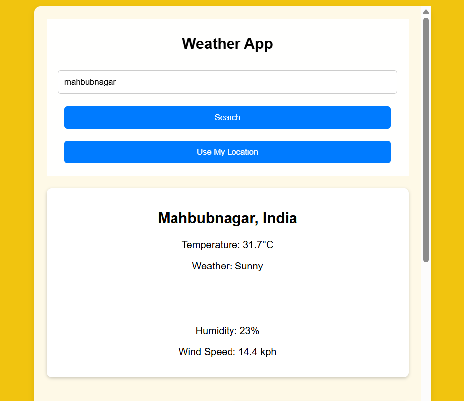
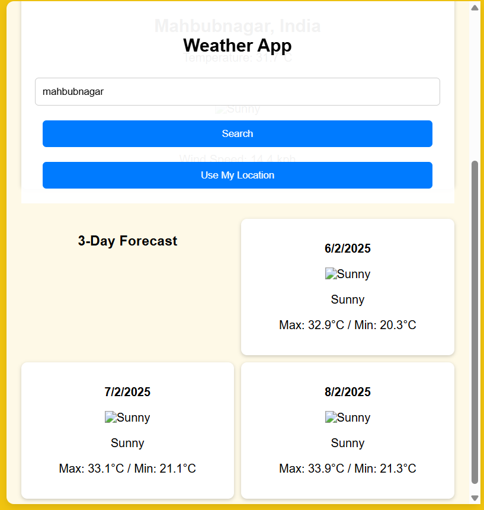
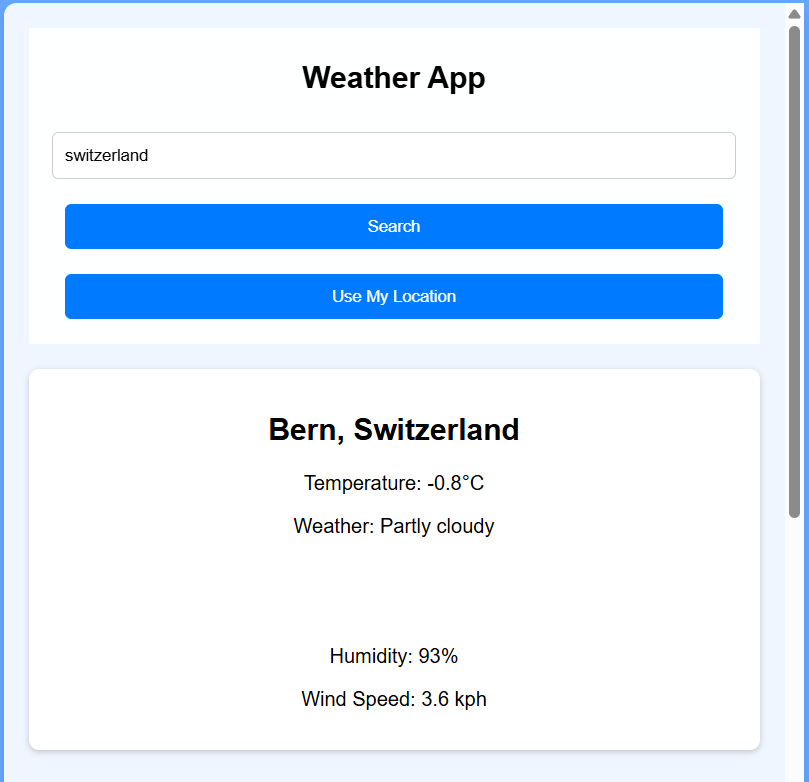
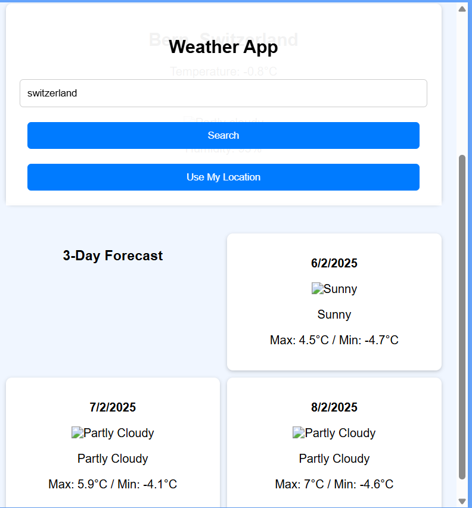

# Enhanced Weather App

A modern and comprehensive weather application that provides detailed weather information, forecasts, and air quality data with an intuitive user interface.

## Features

### Core Features
- Real-time weather data
- 7-day weather forecast
- Temperature unit conversion (°C/°F)
- Air quality information
- Search by city name
- Current location detection
- Search history with local storage

### Weather Information
- Current temperature
- Feels like temperature
- Humidity levels
- Wind speed
- UV Index
- Precipitation
- Atmospheric pressure
- Sunrise/Sunset times

## Screenshots

### Main Interface

### Weather Details

### Forecast View

### Search Results

### Dark Theme

## Technologies Used

- HTML5
- CSS3 (with CSS Variables for theming)
- JavaScript (ES6+)
- [Weather API](https://www.weatherapi.com/)
- [Font Awesome](https://fontawesome.com/) for icons
- LocalStorage for data persistence

## Author

**Uttej P**
- GitHub: [@yu-14](https://github.com/yu-14)
- LinkedIn: [Uttej P](https://www.linkedin.com/in/uttej-p14/)

## License

Copyright © 2024 Pilli Uttej. All rights reserved.